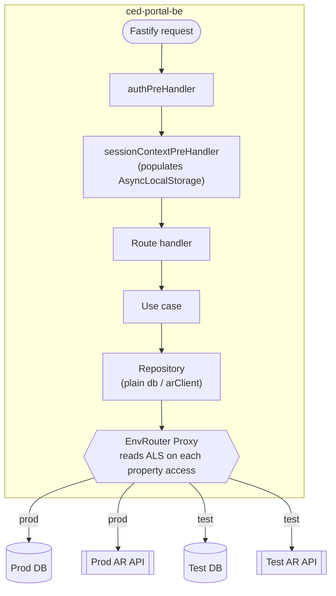
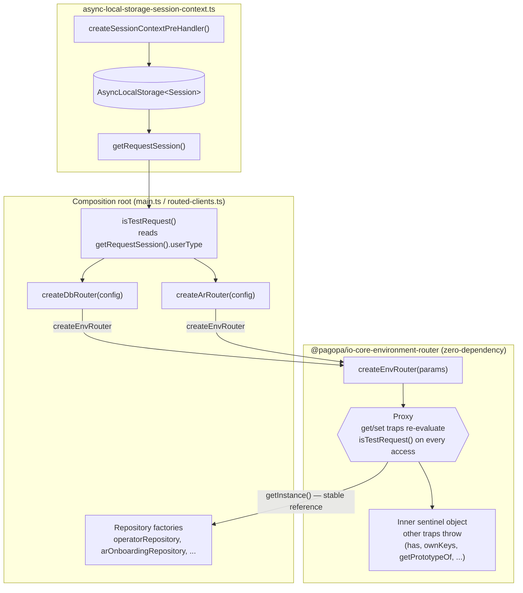
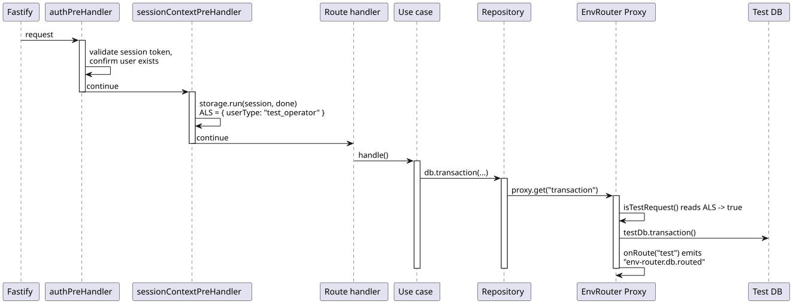
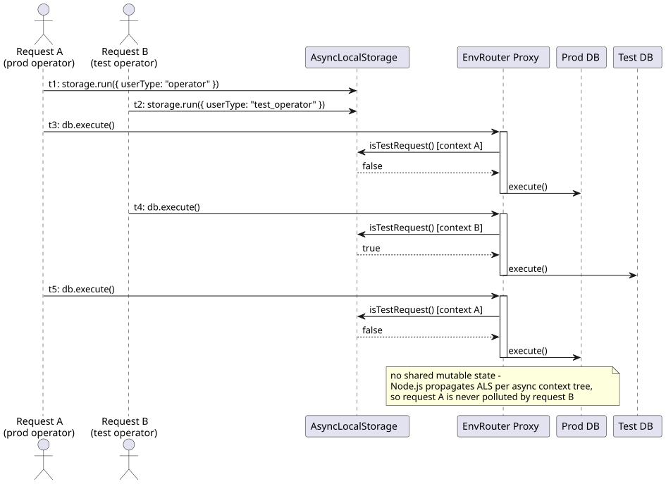
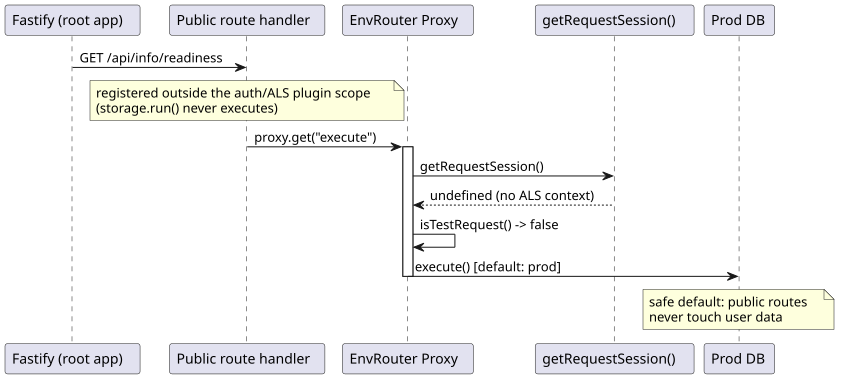

# Environment Routing

## 1. Introduction and Goals

### 1.1 Requirements Overview

The CED portal serves two populations of users from a single deployment:

| User type                     | `userType` values             | Backend target                                    |
| ----------------------------- | ----------------------------- | ------------------------------------------------- |
| Production operators / admins | `operator`, `admin`           | Production PostgreSQL database, Production AR API |
| Test operators / admins       | `test_operator`, `test_admin` | Test PostgreSQL database, Test AR API             |

The routing decision must be:

- **Per-request** — two concurrent requests from different user types must be independently isolated.
- **Transparent to domain code** — repositories and use-cases must not know that two environments exist.
- **Composition-root owned** — the app wires the routing; packages remain generic.

### 1.2 Quality Goals

| Priority | Quality goal           | Scenario                                                                 |
| -------- | ---------------------- | ------------------------------------------------------------------------ |
| 1        | **Data isolation**     | A test user's write must never reach the production database.            |
| 2        | **Concurrency safety** | Concurrent prod and test requests must not pollute each other's context. |
| 3        | **Transparency**       | Repositories accept a plain client; they are unaware of routing.         |
| 4        | **Observability**      | Every routing decision is emitted as a custom telemetry event.           |

---

## 2. Architecture Constraints

- Node.js single-threaded event loop — concurrency is cooperative (async/await), not preemptive threads.
- `AsyncLocalStorage` (Node.js built-in) propagates context through async call chains without explicit passing.
- The monorepo follows hexagonal architecture: domain and application layers must not import infrastructure adapters.
- All packages are ESM-only (`"type": "module"`).

---

## 3. System Scope and Context



_Source: [`diagrams/system-context.mmd`](./diagrams/system-context.mmd)_

---

## 4. Solution Strategy

The core insight is that **`getInstance()` does not need to return a different object per request**. Instead, it returns a single stable `Proxy` whose property-access trap re-evaluates the routing predicate (`isTestRequest`) on every access. Because `isTestRequest` reads from `AsyncLocalStorage` — which Node.js propagates correctly through async call chains — every property access automatically resolves to the correct backing instance for the currently-executing request.

This lets composition-root code capture `getInstance()` **once at startup** and pass the result to repositories as if it were a plain client:

```ts
// main.ts — called once at startup
const db = dbRouter.getInstance(); // returns a Proxy
const arClient = arClientRouter.getInstance(); // returns a Proxy

// repositories receive plain-typed clients — they know nothing about routing
const operatorRepository = createDrizzleOperatorRepository(db);
const arOnboardingRepository = createArOnboardingRepository(arClient);
```

---

## 5. Building Block View



_Source: [`diagrams/building-blocks.mmd`](./diagrams/building-blocks.mmd)_

### 5.1 `@pagopa/io-core-environment-router`

A zero-dependency package that wraps any two singletons behind a `Proxy`.

```
packages/io-core-environment-router/
└── src/
    ├── env-router.ts          # createEnvRouter, EnvRouter, EnvRouterParams, EnvRouterEnv
    ├── index.ts               # public re-exports
    └── __tests__/
        └── env-router.test.ts
```

**Public API:**

```ts
interface EnvRouterParams<TConfig, TInstance extends object> {
  prodConfig: TConfig;
  testConfig: TConfig;
  createProdInstance: (config: TConfig) => TInstance;
  createTestInstance: (config: TConfig) => TInstance;
  isTestRequest: () => boolean; // lazy, re-evaluated on every access
  onRoute?: (env: "prod" | "test") => void; // optional telemetry hook
}

interface EnvRouter<TInstance extends object> {
  getInstance: () => TInstance; // always the same Proxy reference
  instances: readonly TInstance[]; // [prod, test] — for lifecycle/shutdown
}
```

The package is completely generic. It has no knowledge of Fastify, Drizzle, AsyncLocalStorage, or any specific client type. All of those concerns are injected by the consuming app.

The proxy returned by `getInstance()` forwards both **reads and writes**:

- `get` resolves the active instance via `isTestRequest()`, fires `onRoute`, then reads the property with `Reflect.get(active, property, active)`. If the resolved value is a function, it is rebound with `.bind(active)` so that methods relying on `this` (e.g. `db.transaction(...)`) operate on the correct backing instance even when detached from the proxy.
- `set` resolves the active instance the same way and forwards the write with `Reflect.set(active, property, value, active)`.

Every other trap (`defineProperty`, `deleteProperty`, `getPrototypeOf`, `has`, `isExtensible`, `ownKeys`, `preventExtensions`, `setPrototypeOf`) is intentionally **not** forwarded: the proxy wraps an inner sentinel object that throws on those operations. This prevents callers from using the `in` operator, `Object.keys`/spread/`for...in`, or prototype introspection to accidentally bypass routing and observe the sentinel instead of the active instance.

### 5.2 `async-local-storage-session-context.ts` (ced-portal-be)

Owns the single `AsyncLocalStorage<Session>` instance for the whole app.

- `getRequestSession()` — reads the current request's session (or `undefined` outside a request context).
- `createSessionContextPreHandler(getSession)` — Fastify preHandler factory that calls `storage.run(session, done)`, binding the session to the current async context tree.

### 5.3 Composition root (`main.ts` / `routed-clients.ts`)

`routed-clients.ts` builds one `createEnvRouter` call per routed client (`createDbRouter`, `createArRouter`), sharing the same `isTestRequest` predicate. `main.ts` calls `getInstance()` once for each router and threads the proxies into the repository factories:

```ts
const isTestRequest = (): boolean => {
  const userType = getRequestSession()?.userType;
  return userType === "test_admin" || userType === "test_operator";
};

const dbRouter = createDbRouter(config); // createEnvRouter(...) under the hood
const arClientRouter = createArRouter(config);

const dbClient = dbRouter.getInstance(); // stable Proxy
const arClient = arClientRouter.getInstance(); // stable Proxy
```

Each router emits its own custom event name on `onRoute` (`env-router.db.routed`, `env-router.ar.routed`) so telemetry can distinguish which client was routed.

**Test database fallback:** `POSTGRES_DB_TEST` is optional. When unset, `createDbRouter` falls back to `POSTGRES_DB`, i.e. the test instance points at the **prod database** with its own connection pool. `AR_ENDPOINT_TEST`/`AR_API_KEY_TEST` have no such fallback — they are required config. See the Risks table (§9) for the data-isolation implication of the DB fallback.

---

## 6. Runtime View

### 6.1 Authenticated request (test operator)



_Source: [`sequence/authenticated_test_request_sequence.puml`](./sequence/authenticated_test_request_sequence.puml)_

### 6.2 Concurrent prod and test requests



_Source: [`sequence/concurrent_requests_sequence.puml`](./sequence/concurrent_requests_sequence.puml)_

There is **no shared mutable state** in the router. `isTestRequest()` reads only from ALS, which Node.js propagates per async context tree. Each request runs in its own `AsyncLocalStorage` context established by `storage.run()` in the preHandler.

### 6.3 Public routes (no session)

Public routes (`/api/info/startup`, `/api/info/readiness`, `/api/authorize`, `/api/acs`) are registered on the root Fastify app, **outside** the plugin scope that registers the auth and ALS preHandlers. They therefore never execute `storage.run()`.

When a public route causes a proxy property access:



_Source: [`sequence/public_route_sequence.puml`](./sequence/public_route_sequence.puml)_

The prod instance is the correct default for unauthenticated infrastructure calls (e.g., the readiness health check queries the prod database). This is safe because public routes never touch user data.

---

## 7. Design Decisions

### ADR-1: Proxy over factory function

**Context:** Once `getInstance()` is called at startup and its result captured in a closure, a simple function returning the current instance would always return the startup-time value (ALS is empty at startup → always prod).

**Decision:** Use `Proxy` + `Reflect.get`/`Reflect.set` so the routing predicate is re-evaluated on every **property read and write**, not at capture time. Functions read off the active instance are rebound with `.bind(active)` before being returned, so a method captured by the caller (e.g. `const tx = db.transaction; tx(...)`) still runs against the instance that was active when it was read.

**Consequence:** Repositories capture the proxy once and use it as a plain client. Routing is transparent. The caller does not need to call `getInstance()` inside every method.

`Reflect.get(active, property, active)` is used instead of `active[property]` to correctly pass `active` as the receiver (`this`) for property getters that use `this`.

**Rejected alternative:** Inject a getter function `() => TypedDbClient` into every repository. This would work but leaks the routing abstraction into every repository signature and requires disciplined per-method invocation.

### ADR-2: Guard-rail sentinel for non-forwarded proxy traps

**Context:** A `Proxy` only intercepts the traps it defines. Without an explicit `has`, `ownKeys`, or `getPrototypeOf` trap, those operations fall through to the proxy's target object, not to the currently-active instance — silently returning stale or empty results (e.g. `Object.keys(db)` would list the target's keys, not the active instance's).

**Decision:** The proxy wraps an inner sentinel object (instead of a plain `{}`) whose own traps (`defineProperty`, `deleteProperty`, `getPrototypeOf`, `has`, `isExtensible`, `ownKeys`, `preventExtensions`, `setPrototypeOf`) throw a descriptive error. Only `get` and `set` are forwarded to the active instance; every other operation fails fast instead of silently operating on the wrong object.

**Consequence:** Consumers must only use the routed instance via plain property reads/writes and method calls — reflection, spreading, or the `in` operator on a routed client throws immediately with a clear message instead of producing an unnoticed data-isolation bug.

**Error propagation:** these are plain synchronous throws with no special interception by the router itself, so what happens next depends on the call site. Every current repository method wraps client calls in `try/catch` and converts the failure into a `Result` error, so a sentinel trap firing there is reported like any other domain error, not a crash. A throw inside a Fastify route handler without a local `try/catch` is still caught by Fastify's default handler and logged via the `onError` tracing hook, failing only that request. A throw during synchronous composition-root setup (`main.ts`), outside any request lifecycle, would be an uncaught exception and crash the process — `ced-portal-be` has no global `uncaughtException`/`unhandledRejection` handler.

---

## 8. Cross-cutting Concerns

### Observability

Every routing decision can emit a custom event by injecting an `emitCustomEvent` through `onRoute`. Events do not carry any user PII — only the environment name (`"prod"` or `"test"`).

```ts
onRoute: (env) =>
  emitCustomEvent("env-router.db.routed", {
    caller: "DbRouter",
    data: { env },
  })("DbRouter"),
```

### Lifecycle management

We can use `instances` to manage instances created by the router.

For example `dbRouter.instances` exposes `[prodInstance, testInstance]`. The `onClose` hook iterates both to close all connections regardless of which environment was active:

```ts
app.addHook("onClose", async () => {
  await Promise.all(dbRouter.instances.map((db) => db.closeConnection()));
});
```

---

## 9. Risks and Technical Debt

| Risk                                                                                                                                                                                                            | Likelihood | Impact | Mitigation                                                                                                                                                                                                       |
| --------------------------------------------------------------------------------------------------------------------------------------------------------------------------------------------------------------- | ---------- | ------ | ---------------------------------------------------------------------------------------------------------------------------------------------------------------------------------------------------------------- |
| ALS not propagated through a third-party library's internal callbacks                                                                                                                                           | Low        | High   | ALS propagation is part of the Node.js async context spec; any well-behaved library using `async/await` or `Promise` will propagate it correctly.                                                                |
| Readiness check only validates the prod database                                                                                                                                                                | Accepted   | Low    | Health probes check service availability, not all managed environments. A separate monitoring alert on the test DB is recommended.                                                                               |
| `Proxy` `get` trap fires for every property access including non-user-facing ones (e.g., `Symbol.toPrimitive`)                                                                                                  | Accepted   | Low    | `isTestRequest()` is a pure synchronous ALS read — negligible overhead.                                                                                                                                          |
| `POSTGRES_DB_TEST` is optional and falls back to `POSTGRES_DB` when unset                                                                                                                                       | Medium     | High   | Test requests then share the prod database (own connection pool, same data). Set `POSTGRES_DB_TEST` in every environment where isolation matters.                                                                |
| Sentinel traps (ADR-2) throw synchronously; if triggered outside a request lifecycle (e.g. composition-root setup) rather than inside a repository's `try/catch`, the throw is uncaught and crashes the process | Low        | Medium | No consumer currently uses `in`, `Object.keys`, spread, `delete`, or `instanceof` on a routed client — verified across `ced-portal-be`. Keep new consumers to plain property reads/writes and method calls only. |
