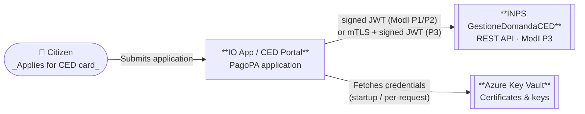
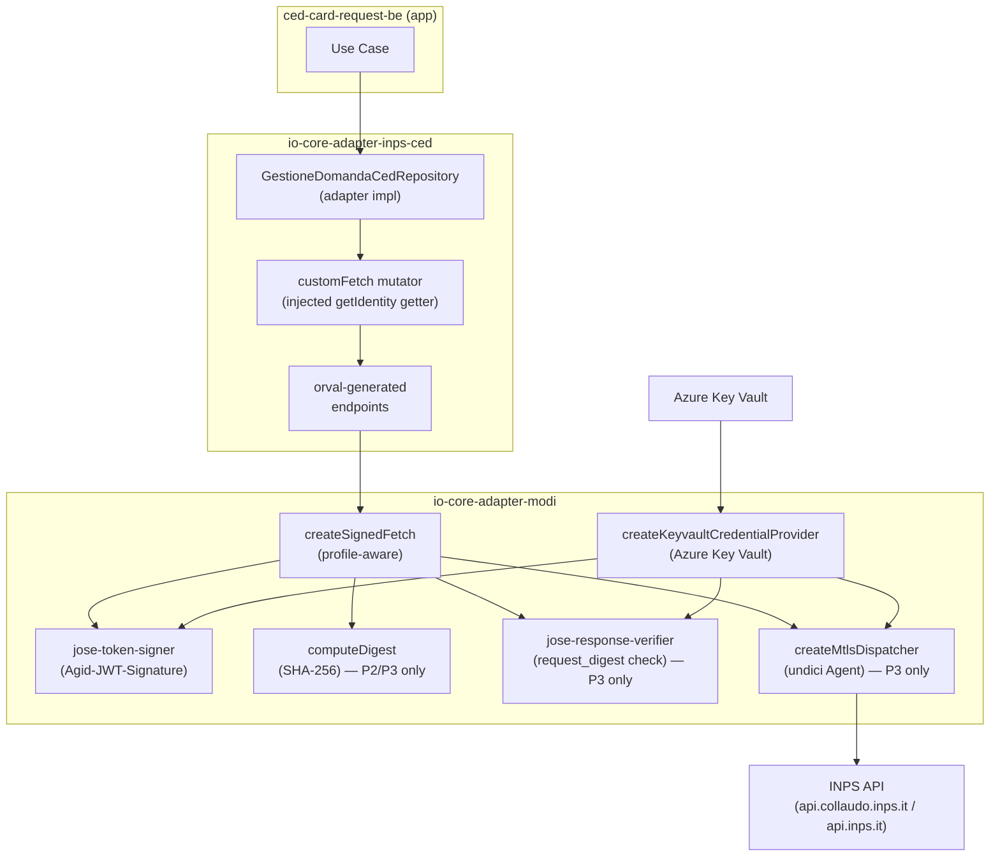
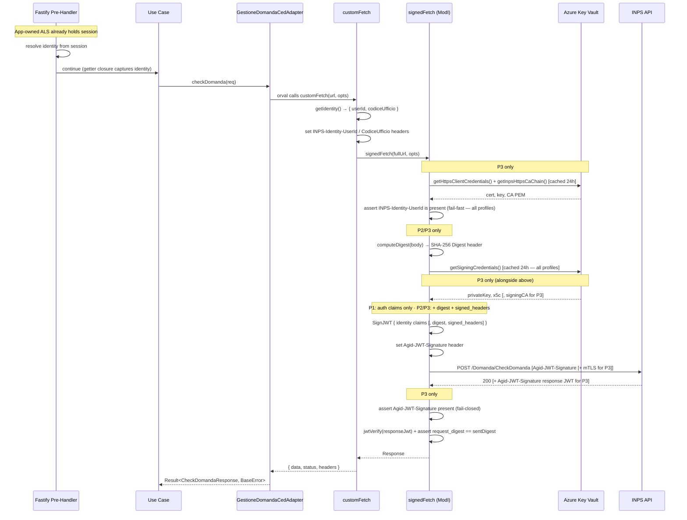
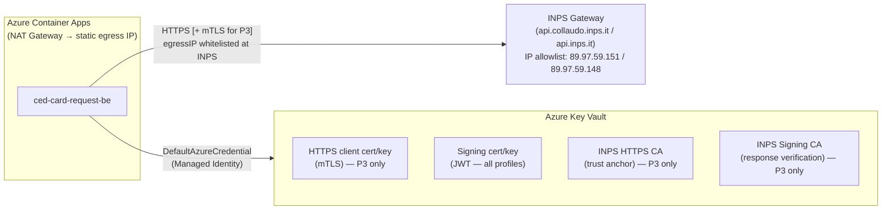

# Design Review: INPS CED API Integration via ModI

## 1. Introduction and Goals

Integrate with INPS _GestioneDomandaCED_ REST APIs using the AGID ModI interoperability framework.
The exact profile is selected at runtime via the `MODI_PROFILE` environment variable.

| Profile                      | ModI Patterns                                                             | mTLS | Body digest | Response non-repudiation |
| ---------------------------- | ------------------------------------------------------------------------- | :--: | :---------: | :----------------------: |
| **P1** — `ID_AUTH_REST_01`   | Auth-only JWT in `Agid-JWT-Signature`                                     |  ❌  |     ❌      |            ❌            |
| **P2** — `INTEGRITY_REST_01` | Auth + body-integrity JWT                                                 |  ❌  |     ✅      |            ❌            |
| **P3** — Full                | `ID_AUTH_CHANNEL_02` + `INTEGRITY_REST_01` + `PROFILE_NON_REPUDIATION_01` |  ✅  |     ✅      |            ✅            |

All profiles require:

| Requirement                               | Mechanism                                                                      |
| ----------------------------------------- | ------------------------------------------------------------------------------ |
| Application-level JWT signing of requests | `ID_AUTH_REST_01` / `INTEGRITY_REST_01` (depth varies by profile)              |
| Caller identity threading                 | INPS `Identity` header (`INPS-Identity-UserId`, `INPS-Identity-CodiceUfficio`) |

---

## 2. Constraints

- All secrets (certificates, private keys, CA chains) stored in **Azure Key Vault**; no plaintext secrets in environment variables. Only the secrets required by the active profile are fetched.
- Generated client code via **orval** from OpenAPI 3.0 (consumed spec owned by INPS).
- Must work with the existing hexagonal architecture: adapters implement `Result<T, BaseError>` ports — no thrown exceptions for business logic errors.
- INPS has not yet completed formal adhesion; `audience`, base URL, and exact JWT header names are provisional until the eService descriptor is confirmed.

---

## 3. Context and Scope

---

## 4. Solution Strategy

Two dedicated packages implement a clean separation of concerns:

| Package                    | Responsibility                                                                                                                                                                                                              |
| -------------------------- | --------------------------------------------------------------------------------------------------------------------------------------------------------------------------------------------------------------------------- |
| `io-core-adapter-modi`     | Generic ModI primitives for all profiles: JWT signer, body-digest, optional mTLS dispatcher, optional response verifier, Key Vault credential provider. Profile selected via `config.profile` (`"P1"` \| `"P2"` \| `"P3"`). |
| `io-core-adapter-inps-ced` | INPS CED-specific: orval-generated client, `customFetch` mutator, outbound adapter implementing the domain port                                                                                                             |

Identity context is propagated per-request using Node.js `AsyncLocalStorage`, which lives **exclusively in the app layer** (`ced-card-request-be`). The adapter packages contain no `async_hooks` dependency. Instead, `initInpsCedClient` accepts a getter function `() => InpsIdentityContext | undefined`; the app supplies a closure that reads from its own ALS and maps the session to the shape required by INPS.

---

## 5. Building Block View

---

## 6. Runtime View — ModI Request Flow (P3 shown; P1/P2 skip dashed steps)

> **P1** skips: Digest header, signing CA fetch, `request_digest` in JWT, and the entire response JWT check.
> **P2** skips: mTLS dispatcher fetch and the response JWT check.

---

## 7. Deployment View

Credential loading strategy:

- **Signing credentials** — cached for 24 h (TTL-based, refreshed lazily on next request after expiry). All profiles.
- **mTLS undici `Agent`** — cached for 24 h (same TTL). **P3 only.** Lazily rebuilt from Key Vault after expiry, enabling certificate rotation without a restart.

---

## 8. Cross-cutting Concepts

### 8.1 Error Handling

All operations return `Result<T, BaseError>` via `neverthrow`. HTTP status codes are mapped:

| HTTP Status   | Domain Error      |
| ------------- | ----------------- |
| 400           | `ValidationError` |
| 404           | `NotFoundError`   |
| 409           | `ConflictError`   |
| 500 / network | `GenericError`    |

JWT signing/verification failures, Key Vault errors, and guard violations (missing `UserId`, missing response JWT) are returned as `err(BaseError)` values inside a `Result`. The `customFetch` mutator (in `io-core-adapter-inps-ced`) unwraps the `Result` and re-throws on error, which the domain adapter's `try/catch` wrapper converts to `GenericError`. This keeps `SignedFetch` a clean `Result`-returning API while remaining compatible with the orval-generated call chain.

### 8.2 Identity Threading

The **app layer** (`ced-card-request-be`) owns `AsyncLocalStorage`. The adapter package has no `async_hooks` dependency.

| Layer                                    | Responsibility                                              | Mechanism                                             |
| ---------------------------------------- | ----------------------------------------------------------- | ----------------------------------------------------- |
| `ced-card-request-be`                    | Owns ALS, sets context per request in a Fastify pre-handler | `AsyncLocalStorage<RequestContext>`                   |
| `ced-card-request-be` (composition root) | Passes a getter closure to the adapter at startup           | `initInpsCedClient(config, signedFetch, getIdentity)` |
| `getIdentity` closure                    | Reads app ALS, maps session fields to `InpsIdentityContext` | `() => InpsIdentityContext \| undefined`              |
| `customFetch` mutator                    | Calls the injected getter to obtain identity headers        | No `async_hooks` import                               |

This mirrors how `ced-portal-be` injects `getRequestSession` into adapters that need session data: the adapter calls a function pointer; the ALS lifecycle is the app's concern.

### 8.3 Idempotency

Mutating operations (`confermaDomanda`, `fornisciFoto`, `nuovaDomandaInBozza`) require a caller-supplied `Idempotency-Key` header forwarded to INPS, enabling safe retries.

### 8.4 Certificate Management

All 6 PEM secrets live in Azure Key Vault for P3. P1/P2 only require the 2 signing secrets. Secret names are injected via `ModiConfig.secretNames` (profile-specific type). No active rotation mechanism for mTLS (P3) — a restart is required to pick up a rotated mTLS certificate; signing credentials refresh automatically after the 24 h TTL.

---

## 9. Architecture Decisions and Pain Points

### ADR-001: Configurable ModI profile (P1 / P2 / P3)

**Decision:** The ModI profile is selected at runtime via `MODI_PROFILE` env var. `io-core-adapter-modi` supports all three profiles in a single `createSignedFetch` factory; the Zod config schema enforces which Key Vault secrets are required per profile.
**Rationale:** INPS adhesion is not finalised and the required profile may be confirmed later. Providing all three profiles avoids a code change when the eService descriptor is received. P3 remains the target for production (strictest security); P1/P2 can be used during integration testing or if INPS formally certifies a weaker profile for certain endpoints.

### ADR-002: orval code generation from consumed OpenAPI

**Decision:** Generate typed client from INPS-provided OpenAPI 3.0 spec using orval.
**Rationale:** Avoids manual HTTP calls and provides compile-time type safety. The spec is manually maintained until INPS adhesion delivers the authoritative eService descriptor.

---

### Pain Points

#### 🔴 P1 — Agid-JWT-Signature header name unconfirmed _(OPEN)_

**File:** `packages/io-core-adapter-inps-ced/openapi/consumed/openapi.yaml` line 820
The consumed OpenAPI declares the ModI JWT in the `Authorization` header, but the runtime sends it as `Agid-JWT-Signature`. The spec contains a TODO comment acknowledging this ambiguity.
**Risk:** If INPS actually expects `Authorization: Bearer <jwt>`, all requests will be rejected.
**Fix:** Confirm the exact header name from the INPS eService descriptor before adhesion testing. Update both the OpenAPI spec and `jose-token-signer.ts`.

#### 🔴 P2 — P3 non-repudiation check not enforced _(FIXED)_

**File:** `packages/io-core-adapter-modi/src/signed-fetch.ts`
~~The `Agid-JWT-Signature` response header was only verified **if present** — absence was silently accepted.~~
**Applied fix:** `signedFetch` now throws `"ModI P3 violation: INPS response is missing the required Agid-JWT-Signature header"` when the header is absent (fail-closed).

#### 🟠 P3 — Silent empty userId _(FIXED)_

**File:** `packages/io-core-adapter-modi/src/signed-fetch.ts`
~~`const userId = headers.get("INPS-Identity-UserId") ?? ""` silently produced a blank `userId` in the signed JWT.~~
**Applied fix:** `signedFetch` now throws `"INPS-Identity-UserId header is required but was not set by the caller"` when the header is missing or empty.

#### 🟠 P4 — Signing credentials fetched from Key Vault on every request _(FIXED)_

**File:** `packages/io-core-adapter-modi/src/signed-fetch.ts`
~~`getSigningCredentials()` and `getInpsSigningCaChain()` were called per request (2 Key Vault round-trips with no caching).~~
**Applied fix:** Signing credentials are now cached inside the `createSignedFetch` closure with a 24 h TTL (`CachedSigningCredentials` + `expiresAt`), refreshed lazily on the next request after expiry.

#### 🟡 P5 — signedFetch throws instead of returning Result _(FIXED)_

**File:** `packages/io-core-adapter-modi/src/signed-fetch.ts`
~~`SignedFetch` was typed as `(url, options) => Promise<Response>` and threw exceptions for Key Vault failures, JWT errors, and guard violations.~~
**Applied fix:** `SignedFetch` now returns `Promise<Result<Response, BaseError>>`. All internal `throw` statements are replaced with `return err(...)`. An outer `try/catch` converts unexpected failures from internal helpers into `GenericError`. The `customFetch` mutator in `io-core-adapter-inps-ced` unwraps the `Result` and re-throws on error, bridging into the orval-generated call chain.

#### 🟡 P6 — ModiRequestContext entity exported but unused _(FIXED)_

**Files:** `packages/io-core-adapter-modi/src/domain/entities.ts`, `src/index.ts`
~~`ModiRequestContext` was exported in the public API but identity was threaded via raw headers, not this type.~~
**Applied fix:** The unused interface and its barrel export have been removed.

#### 🟡 P7 — Stale sequence diagrams _(FIXED)_

**Files:** `docs/ced-card-request/sequence/*.puml` (5 files)
~~Diagrams labelled INPS as `"INPS Services (PDND)"`. PDND was administratively discarded.~~
**Applied fix:** All 5 diagrams updated to `"INPS Services (ModI P3)"`.

#### 🟡 P8 — mTLS dispatcher cache invalidation on certificate rotation _(FIXED)_

**File:** `packages/io-core-adapter-modi/src/signed-fetch.ts`
~~The `cachedDispatcher` lived for the process lifetime. Rotating the HTTPS client certificate in Key Vault had no effect until restart.~~
**Applied fix:** The mTLS dispatcher is now cached with the same 24 h TTL as the signing credentials (`CACHE_TTL_MS`). After expiry the dispatcher is lazily rebuilt from fresh Key Vault secrets on the next request, picking up any rotated certificate without a restart.

---

## 10. Quality Requirements

| Quality         | Mechanism                                                                     | Status                                                              |
| --------------- | ----------------------------------------------------------------------------- | ------------------------------------------------------------------- |
| Confidentiality | JWT signing (all profiles); mTLS (P3 only)                                    | Header name unconfirmed (P1); profile selectable via `MODI_PROFILE` |
| Non-repudiation | Response JWT verification fail-closed (P3 only; P1/P2 don’t require it)       | Fixed (P2)                                                          |
| Auditability    | Identity headers in signed JWT; fail-fast on empty `UserId` (all profiles)    | Fixed (P3)                                                          |
| Availability    | Signing credentials cached 24 h (all profiles); mTLS dispatcher cached for P3 | Signing creds fixed (P4); mTLS cache still no TTL (P8)              |
| Performance     | 24 h credential cache avoids per-request Key Vault round-trips (all profiles) | Fixed (P4)                                                          |

---

## 11. Risks and Technical Debt

| ID  | Severity | Description                                                                                                     | Status                                                                             |
| --- | -------- | --------------------------------------------------------------------------------------------------------------- | ---------------------------------------------------------------------------------- |
| R1  | HIGH     | Adhesion not finalised — `audience`, base URL, JWT header name are provisional; profile may be mandated by INPS | Block prod deploy on eService descriptor confirmation; P3 is the production target |
