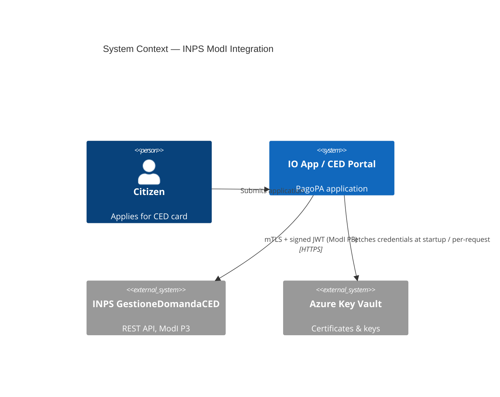
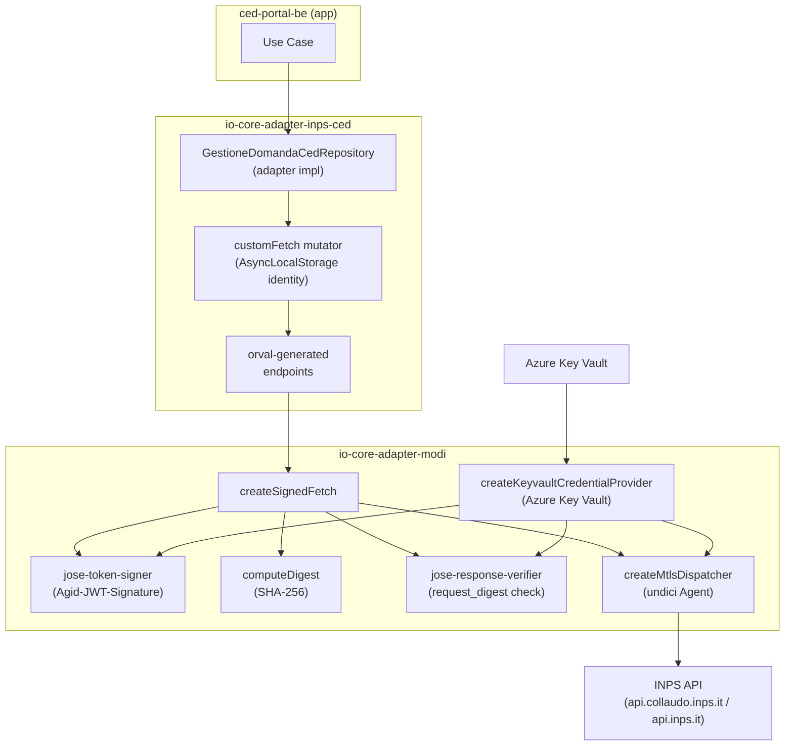
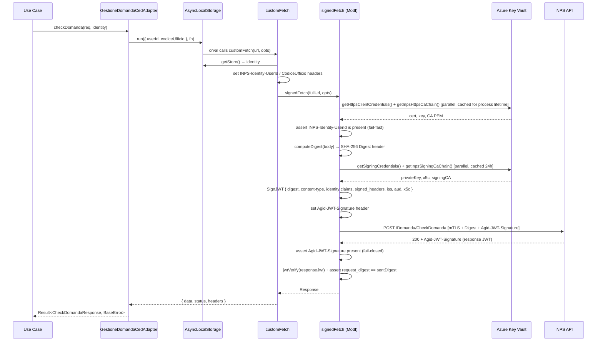
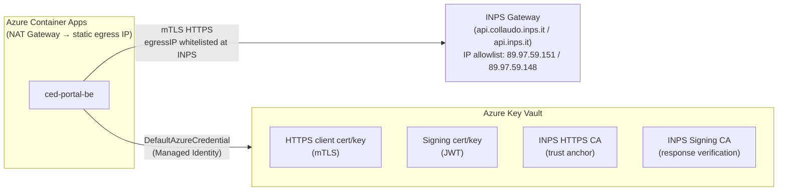

# Design Review: INPS CED API Integration via ModI

## 1. Introduction and Goals

Integrate with INPS _GestioneDomandaCED_ REST APIs using the AGID ModI P3
interoperability profile, which mandates:

| Requirement                               | ModI Pattern                                                                   |
| ----------------------------------------- | ------------------------------------------------------------------------------ |
| Mutual TLS between domains                | `ID_AUTH_CHANNEL_02`                                                           |
| Application-level JWT signing of requests | `ID_AUTH_REST_01` / `INTEGRITY_REST_01`                                        |
| Non-repudiation: INPS signs responses     | `PROFILE_NON_REPUDIATION_01`                                                   |
| Caller identity threading                 | INPS `Identity` header (`INPS-Identity-UserId`, `INPS-Identity-CodiceUfficio`) |

---

## 2. Constraints

- All secrets (certificates, private keys, CA chains) stored in **Azure Key Vault**; no plaintext secrets in environment variables.
- Generated client code via **orval** from OpenAPI 3.0 (consumed spec owned by INPS).
- Must work with the existing hexagonal architecture: adapters implement `Result<T, BaseError>` ports — no thrown exceptions for business logic errors.
- INPS has not yet completed formal adhesion; `audience`, base URL, and exact JWT header names are provisional until the eService descriptor is confirmed.

---

## 3. Context and Scope

---

## 4. Solution Strategy

Two dedicated packages implement a clean separation of concerns:

| Package                    | Responsibility                                                                                                  |
| -------------------------- | --------------------------------------------------------------------------------------------------------------- |
| `io-core-adapter-modi`     | Generic ModI P3 primitives: mTLS dispatcher, JWT signer, response verifier, Key Vault credential provider       |
| `io-core-adapter-inps-ced` | INPS CED-specific: orval-generated client, `customFetch` mutator, outbound adapter implementing the domain port |

Identity context is propagated per-request using Node.js `AsyncLocalStorage`, avoiding global state races in concurrent requests.

---

## 5. Building Block View

---

## 6. Runtime View — ModI P3 Request Flow

---

## 7. Deployment View

Credential loading strategy:

- **mTLS undici `Agent`** — cached for process lifetime after first Key Vault fetch.
- **Signing credentials** — cached for 24 h (TTL-based, refreshed lazily on next request after expiry).
- A process restart is required to pick up a rotated mTLS certificate.

---

## 8. Cross-cutting Concepts

### 8.1 Error Handling

All operations return `Result<T, BaseError>` via `neverthrow`. HTTP status codes are mapped:

| HTTP Status   | Domain Error      |
| ------------- | ----------------- |
| 400           | `ValidationError` |
| 404           | `NotFoundError`   |
| 409           | `ConflictError`   |
| 500 / network | `GenericError`    |

JWT signing/verification failures are converted to `GenericError` / `UnauthorizedError` and **thrown** (not returned as `Result`) inside `signedFetch`, propagating as exceptions to the caller. The domain adapter's `try/catch` wrapper converts them to `GenericError`. This is an accepted trade-off to keep `SignedFetch` compatible with the standard `fetch` interface.

### 8.2 Identity Threading

`AsyncLocalStorage<InpsIdentityContext>` in `client.ts` ensures per-request isolation. The outbound adapter calls `identityStore.run(ctx, () => generatedEndpoint(...))` before each generated call so concurrent requests carry independent identities without changing generated signatures.

### 8.3 Idempotency

Mutating operations (`confermaDomanda`, `fornisciFoto`, `nuovaDomandaInBozza`) require a caller-supplied `Idempotency-Key` header forwarded to INPS, enabling safe retries.

### 8.4 Certificate Management

All 6 PEM secrets live in Azure Key Vault. Secret names are injected via `ModiConfig.secretNames`. No active rotation mechanism — a restart is required to pick up a rotated mTLS certificate; signing credentials refresh automatically after the 24 h TTL.

---

## 9. Architecture Decisions and Pain Points

### ADR-001: ModI P3 profile (not P1/P2)

**Decision:** Use the strictest profile (mTLS + message signing + non-repudiation) for all GestioneDomandaCED operations.
**Rationale:** Conforms to INPS requirements per the PDF guidelines. Simpler but weaker profiles are not supported for this API.

### ADR-002: orval code generation from consumed OpenAPI

**Decision:** Generate typed client from INPS-provided OpenAPI 3.0 spec using orval.
**Rationale:** Avoids manual HTTP calls and provides compile-time type safety. The spec is manually maintained until INPS adhesion delivers the authoritative eService descriptor.

---

### Pain Points

#### 🔴 P1 — Agid-JWT-Signature header name unconfirmed _(OPEN)_

**File:** `packages/io-core-adapter-inps-ced/openapi/consumed/openapi.yaml` line 820
The consumed OpenAPI declares the ModI JWT in the `Authorization` header, but the runtime sends it as `Agid-JWT-Signature`. The spec contains a TODO comment acknowledging this ambiguity.
**Risk:** If INPS actually expects `Authorization: Bearer <jwt>`, all requests will be rejected.
**Fix:** Confirm the exact header name from the INPS eService descriptor before adhesion testing. Update both the OpenAPI spec and `jose-token-signer.ts`.

#### 🔴 P2 — P3 non-repudiation check not enforced _(FIXED)_

**File:** `packages/io-core-adapter-modi/src/signed-fetch.ts`
~~The `Agid-JWT-Signature` response header was only verified **if present** — absence was silently accepted.~~
**Applied fix:** `signedFetch` now throws `"ModI P3 violation: INPS response is missing the required Agid-JWT-Signature header"` when the header is absent (fail-closed).

#### 🟠 P3 — Silent empty userId _(FIXED)_

**File:** `packages/io-core-adapter-modi/src/signed-fetch.ts`
~~`const userId = headers.get("INPS-Identity-UserId") ?? ""` silently produced a blank `userId` in the signed JWT.~~
**Applied fix:** `signedFetch` now throws `"INPS-Identity-UserId header is required but was not set by the caller"` when the header is missing or empty.

#### 🟠 P4 — Signing credentials fetched from Key Vault on every request _(FIXED)_

**File:** `packages/io-core-adapter-modi/src/signed-fetch.ts`
~~`getSigningCredentials()` and `getInpsSigningCaChain()` were called per request (2 Key Vault round-trips with no caching).~~
**Applied fix:** Signing credentials are now cached inside the `createSignedFetch` closure with a 24 h TTL (`CachedSigningCredentials` + `expiresAt`), refreshed lazily on the next request after expiry.

#### 🟡 P5 — signedFetch throws instead of returning Result (contract inconsistency)

**File:** `packages/io-core-adapter-modi/src/signed-fetch.ts`
Key Vault failures, JWT signing errors, and response verification failures surface as thrown exceptions. The domain adapter's `try/catch` absorbs them, but callers outside that wrapper will see unhandled promise rejections.
**Accepted trade-off:** `SignedFetch` is typed as `(url, options) => Promise<Response>` to remain compatible with the `fetch` interface. Callers must wrap in `try/catch`.
**Future option:** Introduce `SafeSignedFetch = (...) => Promise<Result<Response, BaseError>>` as an alternative export.

#### 🟡 P6 — ModiRequestContext entity exported but unused _(FIXED)_

**Files:** `packages/io-core-adapter-modi/src/domain/entities.ts`, `src/index.ts`
~~`ModiRequestContext` was exported in the public API but identity was threaded via raw headers, not this type.~~
**Applied fix:** The unused interface and its barrel export have been removed.

#### 🟡 P7 — Stale sequence diagrams _(FIXED)_

**Files:** `docs/ced-card-request/sequence/*.puml` (5 files)
~~Diagrams labelled INPS as `"INPS Services (PDND)"`. PDND was administratively discarded.~~
**Applied fix:** All 5 diagrams updated to `"INPS Services (ModI P3)"`.

#### 🟡 P8 — No mTLS dispatcher cache invalidation on certificate rotation

**File:** `packages/io-core-adapter-modi/src/signed-fetch.ts`
The `cachedDispatcher` lives for the process lifetime. Rotating the HTTPS client certificate in Key Vault has no effect until restart.
**Fix:** Add TTL-based cache expiry (e.g. 24 h, matching signing credentials) or implement a forced reload path.

#### 🔴 P9 — Terraform: Key Vault secrets read via data source (Trivy HIGH)

**File:** `infra/resources/ced/prod/data.tf` lines 10, 15
`AVD-DX-0001`: Terraform must not read Key Vault secrets via `data` sources — secrets read this way appear in plan output and Terraform state.
**Fix:** Use `azurerm_key_vault_secret` with `value_wo` (write-only pattern, Terraform ≥ 1.11 / azurerm ≥ 4.23) or remove the data sources entirely and resolve secrets at runtime via Managed Identity.

---

## 10. Quality Requirements

| Quality         | Mechanism                                                      | Status                                                 |
| --------------- | -------------------------------------------------------------- | ------------------------------------------------------ |
| Confidentiality | mTLS + JWT                                                     | Header name unconfirmed (P1)                           |
| Non-repudiation | Response JWT verification (fail-closed)                        | Fixed (P2)                                             |
| Auditability    | Identity headers in signed JWT, fail-fast on empty userId      | Fixed (P3)                                             |
| Availability    | Cached dispatcher + signing credentials (24 h TTL)             | Signing creds fixed (P4); mTLS cache still no TTL (P8) |
| Performance     | 24 h credential cache avoids per-request Key Vault round-trips | Fixed (P4)                                             |

---

## 11. Risks and Technical Debt

| ID  | Severity | Description                                                                    | Status                                                |
| --- | -------- | ------------------------------------------------------------------------------ | ----------------------------------------------------- |
| R1  | HIGH     | Adhesion not finalised — `audience`, base URL, JWT header name are provisional | Block prod deploy on eService descriptor confirmation |
| R2  | HIGH     | Trivy: Key Vault secrets read via Terraform data sources                       | Open (P9)                                             |
| R3  | MED      | mTLS certificate rotation requires process restart                             | Open (P8)                                             |
| R4  | LOW      | `signedFetch` throws instead of returning `Result`                             | Accepted trade-off (P5)                               |
